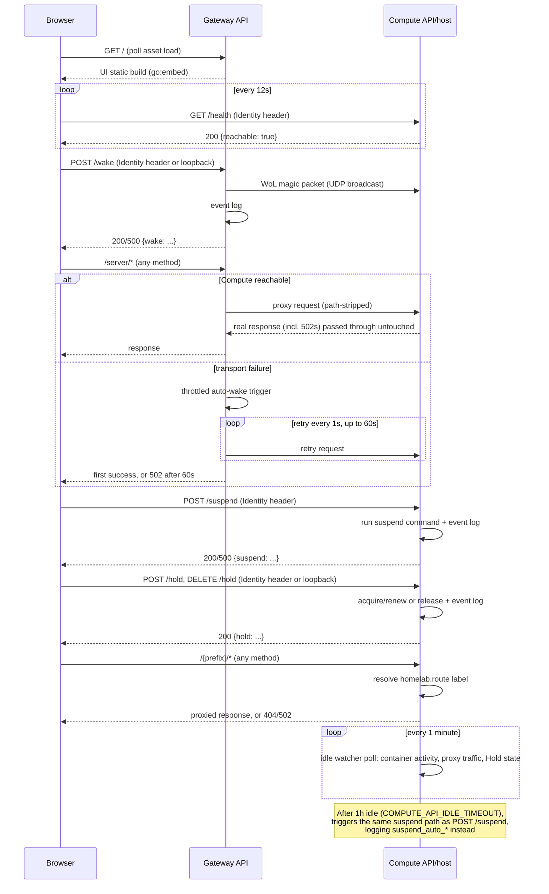

# Architecture

Primary architecture reference for the homelab control plane: current architecture, key decisions, and constraints. Domain vocabulary: [`CONTEXT.md`](CONTEXT.md). Documents the system as it exists today, not superseded designs.

## System Overview

**Purpose**: wake, monitor, and suspend the main workload machine ("Compute") from anywhere on the tailnet, so it can host Docker services (Immich, AI agents, etc.) without running 24/7.

Two physical devices on the same tailnet and LAN broadcast domain.

| Component | Responsibility |
|---|---|
| UI | Browser SPA. Polls Compute reachability, offers Wake/Suspend. |
| Gateway API | Serves the UI's static build, sends WoL on `POST /wake`, reverse-proxies `/server/*` to Compute with auto-wake-on-failure. |
| Compute API | Exposes `GET /health`, `POST /suspend`, Hold (`POST`/`DELETE /hold`), `GET /status`, and its own reverse proxy to workload containers behind an idle watcher that auto-suspends. |
| Provisioning (pyinfra) | Converges both devices to their target state — Tailscale, Docker, both binaries. |

## Architecture

Repo layout is in the [root README](README.md#repo-layout). Per-service detail —
routes, environment, deployment — is in [`docs/gateway.md`](docs/gateway.md),
[`docs/compute.md`](docs/compute.md), [`docs/ui.md`](docs/ui.md) and
[`docs/deploy.md`](docs/deploy.md).

### Shared Go packages

Four `internal/` packages both binaries depend on, none a standalone service:

- **`tailnet`** — `RequireTailnetIdentity` middleware rejects requests missing
  the Identity header with a 401; `GetCallerIdentity` reads it back (presence is
  the entire check, no allow-list). `AssertTailnetOnlyBind(host)`, called at
  handler construction, errors unless `host` is loopback or a Tailscale address.
- **`eventlog`** — `GrafanaCloudLogger.SendEvent(...)` ships structured
  wake/suspend/reachability events to Grafana Cloud's Loki push endpoint. Both
  apps are stateless, so Grafana Cloud is the only place this history lives;
  transport failures are logged and swallowed. `MustGrafanaConfig()` reads the
  `GRAFANA_CLOUD_LOKI_*` trio, shared by both `cmd/*/main.go`.
- **`httpresponse`** — JSON response writing and response pass-through.
- **`env`** — env-var lookup helpers.

### How they interact

- The browser talks to **two origins directly** — Gateway (UI + Gateway API, same-origin) and Compute API (separate origin) — no server-side relay. Compute API's only extra cost is a one-entry CORS allow-list.
- `/server/*` reverse-proxies through the Gateway API to a single fixed upstream on Compute. Which path reaches which Docker service is entirely that upstream's concern — Compute API's own reverse proxy, routing by a `homelab.route` label on each container, no sidecar or static config.
- Gateway API's auto-wake is an **in-process call**: the proxy's error handler and the `/wake` handler both call the same private `doWake` directly. Compute API's idle watcher follows the identical pattern for suspend: it and the `/suspend` handler both call the same `Suspender.Suspend()`.
- Every request Compute API's proxy forwards doubles as the idle watcher's activity signal — no separate metrics API to poll.
- The deploy layer depends on control-plane and ui; neither depends on it.

## Domain Model

See [`CONTEXT.md`](CONTEXT.md).

### Key entities (code level)

- `gateway.Handler` / `compute.Handler` — one per binary, own the route table and dependencies.
- `reachabilityTracker` (`internal/compute`) — logs `reachability_changed` once per process lifetime via `sync.Once`; can't observe going *un*reachable, since the process is asleep whenever that's true.
- `autoWakeThrottler` (`internal/gateway`) — single `lastRun` timestamp, gating repeat wakes to once per 90s.
- `GrafanaCloudLogger` (`internal/eventlog`) — sole implementation of both apps' `EventLogger` interface.

### Key workflows

1. **Reachability polling** — UI polls `GET /health`; renders Reachable/Unreachable, toggles Wake/Suspend.
2. **Deliberate wake** — Wake button → `POST /wake` → WoL packet + `wake_*` events.
3. **Automatic wake** — `/server/*` request while asleep → transport failure → throttled wake → retried every 1s for up to 60s → first success written through.
4. **Suspend** — Suspend button → `POST /suspend` → suspend command + `suspend_*` events.
5. **Hold** — backup/restore script → `POST /hold` (30-min TTL, renew by calling again) → blocks automatic suspend until released (`DELETE /hold`) or expiry.
6. **Automatic suspend** — idle watcher polls once a minute; after an hour with no container activity, proxied traffic, or active Hold, calls the same suspend path as the manual button, logging `suspend_auto_*` instead of `suspend_*`.
7. **Deploy** — `./deploy.sh` → pyinfra over SSH → builds/ships binaries + UI, converges systemd and `tailscale serve` on both devices.

## Data Flow

### Request paths

### External integrations

| Integration | Purpose | Notes |
|---|---|---|
| **Tailscale** (`tailscale serve`) | TLS termination + identity injection; WoL is a raw UDP broadcast, not over Tailscale. | Entire authn/authz boundary is tailnet membership. |
| **Grafana Cloud Loki push API** | Structured event log (wake/suspend/reachability). | No local collector. Failures are logged and swallowed. |

## Key Design Decisions

- **No server-side relay between the UI's two backend origins** — avoids the Compute API trusting a forwarded identity claim over the real header.
- **Suspend-to-RAM only, no full shutdown** — WoL after ACPI S5 is unreliable across BIOS/NIC configs; the suspend command isn't configurable via env var.
- **Compute is its own reverse proxy, no sidecar (Caddy/Traefik) or static routing config** — a sidecar adds a dependency whose own availability the idle watcher would have to reason about; static config would mean every new workload needs a compute-api change and redeploy.
- **Workload routing is Docker-label auto-discovery** (`homelab.route=/path`) — a new workload becomes reachable by adding a label to its compose file, never by touching this repo.
- **Idle signal is container CPU activity, recent proxied traffic, or an active Hold — never container running-state alone** — workload containers run continuously via `restart: unless-stopped` regardless of actual use.
- **No graceful workload shutdown before suspend** — suspend-to-RAM freezes every process atomically via the kernel's freezer cgroup and resumes it in place; there's no in-flight work to lose, so nothing to drain.
- **Idle-watcher last-activity resets when `Suspender.Suspend()` returns, not on process start** — suspend-to-RAM doesn't restart the process, so a process-start-only reset would never fire again on wake; the blocking call returning is the exact, guaranteed wake signal.
- **Hold has a fixed, mandatory 30-minute TTL, no caller-specified duration, and blocks only automatic suspend** — an indefinite hold risks stranding Compute awake if a script crashes before releasing it; blocking manual suspend too would let a stuck Hold strand the owner unable to suspend their own machine.
- **Idle-watcher dry-run gates the decision to call the suspender, not the suspend command itself** — the command stays non-configurable per the rule above, while `COMPUTE_API_AUTOSUSPEND_DRY_RUN` still exercises the real polling/timer/decision logic end-to-end.
- **WoL requires the same L2 broadcast domain** — accepted rather than building a cross-subnet relay.
- **Tailnet membership is the entire authorization boundary** — no separate allow-list.
- **Events ship directly to Grafana Cloud, no local collector** — not worth a self-hosted Alloy instance for low-volume audit events.
- **Both apps are Go, built and shipped as binaries** — no interpreter/dependency tree on-device; suits low-resource hardware like the Pi Zero.
- **The UI is also built off-device** — the Pi Zero is single-core/low-memory; only `dist/` ships.
- **systemd, not Docker, for both apps** — the Compute API must stay controllable while Docker itself redeploys.
- **Deploys are manually triggered only** — no CI/cron/hook, to avoid unattended-deploy risk on a two-device setup.
- **Secrets are plain dev-machine environment variables** — an encrypted-secrets workflow is unneeded for a single-operator setup.

## Extension Points

- **New control-plane action**: add a route in the relevant `NewHandler`, define a small interface for external effects, fake it in tests. Follow `handleWake`/`handleSuspend`'s shape: log `_requested`, perform the effect, log `_succeeded`/`_failed`, write JSON.
- **New workload service behind `/server/*`**: add `homelab.route=/path` to its compose file — no Gateway or Compute API change, no redeploy.
- **New deployed component**: add `deploy/deploy_<name>.py`, gate with `common.has_device_role(...)`, add settings if needed, `local.include(...)` it from `deploy.py`.
- **New event type**: call `logger.SendEvent(eventType, outcome, identity, extra)` — no schema migration; labels are fixed, everything else rides in the log line.

## Constraints

**Assumptions**
- Gateway and Compute stay on the same L2 broadcast domain; no cross-subnet WoL path or error signal if that stops being true.
- Single-operator, two-device scale — not multi-tenant, no fleet of compute hosts, no concurrent deploys.
- Exactly one compute upstream: the auto-wake throttle and `/server/*` proxy both assume a single fixed target.

**Performance**
- UI polls `/health` every 12s with a 5s client timeout, so a powered-off host doesn't strand the UI in "Checking…".
- A cold `/server/*` request holds the connection up to 60s (1s retries) waiting for Compute to wake.
- Automatic wake is throttled to once per 90s regardless of request volume.
- The idle watcher polls once a minute (fixed); default idle timeout is 1h (`COMPUTE_API_IDLE_TIMEOUT`).

**Security**
- Auth is tailnet membership via `Tailscale-User-Login` — no app-level user store or allow-list.
- Two exceptions, both loopback-scoped: `/wake` (Gateway API's in-process auto-wake trigger) and both `/hold` endpoints (Compute API, for unattended backup/restore scripts with no browser session). `GET /status` has no such exception — it's a read diagnostic, not an automation target.
- `tailnet.AssertTailnetOnlyBind` is a structural backstop: both binaries refuse to start if their bind address isn't loopback or tailnet.
- Compute API's CORS policy allows exactly one origin.

**Known limitations**
- No error path if Gateway and Compute split onto different broadcast domains/VLANs — WoL packets just stop arriving.
- `reachabilityTracker` can only observe Compute *becoming* reachable, never unreachable, since the process is asleep whenever that transition happens.
- The Grafana Cloud pipeline has no retry/buffering — a transient outage drops the event. Accepted for low-stakes audit events.
- Bind-address enforcement is a runtime check per binary; pyinfra doesn't verify it at provisioning time.
- Compute API's container-activity signal is CPU-only; a network-delta signal (for a low-CPU, high-network workload like a large file transfer) is deferred — nothing routable today needs it.
- No workload Compose stack (Immich, etc.) has been deployed yet for Compute's proxy to route to — Docker is provisioned, but exercising the proxy end-to-end still needs a labeled container stood up.
