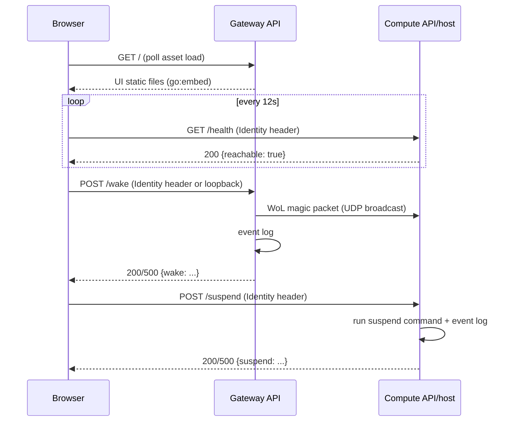

# Architecture

Primary architecture reference for the homelab control plane: current architecture, key decisions, and constraints. Domain vocabulary: [`CONTEXT.md`](CONTEXT.md). Documents the system as it exists today, not superseded designs.

## System Overview

**Purpose**: wake, monitor, and suspend the main workload machine ("Compute") from anywhere on the tailnet, so it can host Docker services (Immich, AI agents, etc.) without running 24/7.

Two physical devices on the same tailnet and LAN broadcast domain.

| Component | Responsibility |
|---|---|
| UI | Browser SPA. Polls Compute reachability, offers Wake/Suspend. |
| Gateway API | Serves the UI's static files and sends WoL on `POST /wake`. Carries no workload traffic. |
| Compute API | Exposes `GET /health` and `POST /suspend`. |
| Provisioning (pyinfra) | Converges both devices to their target state — Tailscale, Docker, both binaries. |

## Architecture

Repo layout is in the [root README](README.md#repo-layout). Per-service detail —
routes, environment, deployment — is in [`docs/gateway.md`](docs/gateway.md),
[`docs/compute.md`](docs/compute.md), [`docs/ui.md`](docs/ui.md) and
[`docs/deploy.md`](docs/deploy.md).

### Shared Go packages

Four `internal/` packages both binaries depend on, none a standalone service:

- **`tailnet`** — `RequireTailnetIdentity` middleware rejects requests missing
  the Identity header with a 401; `GetCallerIdentity` reads it back (presence is
  the entire check, no allow-list). `AssertTailnetOnlyBind(host)`, called at
  handler construction, errors unless `host` is loopback or a Tailscale address.
- **`eventlog`** — `GrafanaCloudLogger.SendEvent(...)` ships structured
  wake/suspend/reachability events to Grafana Cloud's Loki push endpoint. Both
  apps are stateless, so Grafana Cloud is the only place this history lives;
  transport failures are logged and swallowed. `MustGrafanaConfig()` reads the
  `GRAFANA_CLOUD_LOKI_*` trio, shared by both `cmd/*/main.go`.
- **`httpresponse`** — JSON response writing.
- **`env`** — env-var lookup helpers.

### How they interact

- The browser talks to **two origins directly** — Gateway (UI + Gateway API, same-origin) and Compute API (separate origin) — no server-side relay. Compute API's only extra cost is a one-entry CORS allow-list.
- Workload traffic never touches the control plane. Each workload container publishes its own port on Compute and browsers reach it directly over the tailnet.
- The deploy layer depends on the Go module and `ui/`; neither depends on it.

## Domain Model

See [`CONTEXT.md`](CONTEXT.md).

### Key entities (code level)

- `gateway.Handler` / `compute.Handler` — one per binary, own the route table and dependencies.
- `reachabilityTracker` (`internal/compute`) — logs `reachability_changed` once per process lifetime via `sync.Once`; can't observe going *un*reachable, since the process is asleep whenever that's true.
- `GrafanaCloudLogger` (`internal/eventlog`) — sole implementation of both apps' `EventLogger` interface.

### Key workflows

1. **Reachability polling** — UI polls `GET /health`; renders Reachable/Unreachable, toggles Wake/Suspend.
2. **Wake** — Wake button → `POST /wake` → WoL packet + `wake_*` events. The only wake path; nothing wakes Compute automatically.
3. **Suspend** — Suspend button → `POST /suspend` → suspend command + `suspend_*` events.
4. **Deploy** — `./deploy.sh` → pyinfra over SSH → builds/ships binaries + UI, converges systemd and `tailscale serve` on both devices.

## Data Flow

### Request paths

### External integrations

| Integration | Purpose | Notes |
|---|---|---|
| **Tailscale** (`tailscale serve`) | TLS termination + identity injection; WoL is a raw UDP broadcast, not over Tailscale. | Entire authn/authz boundary is tailnet membership. |
| **Grafana Cloud Loki push API** | Structured event log (wake/suspend/reachability). | No local collector. Failures are logged and swallowed. |

## Key Design Decisions

- **No server-side relay between the UI's two backend origins** — avoids the Compute API trusting a forwarded identity claim over the real header.
- **The Gateway carries no workload traffic** — it's a Pi Zero W on Wi-Fi, so proxying workload traffic through it adds a hop and a bandwidth ceiling for nothing when `tailscale serve` already gives Compute its own reachable HTTPS origin. Cost: auto-wake-on-request is gone, since the Gateway no longer sees workload requests.
- **Suspend-to-RAM only, no full shutdown** — WoL after ACPI S5 is unreliable across BIOS/NIC configs; the suspend command isn't configurable via env var.
- **Nothing in this repo proxies workload traffic** — no sidecar (Caddy/Traefik), no routing config, no route awareness in Compute API. Each container publishes a host port and Docker serves it; a proxy would be a second thing to keep in sync with the compose files for no gain on a single-host tailnet.
- **No graceful workload shutdown before suspend** — suspend-to-RAM freezes every process atomically via the kernel's freezer cgroup and resumes it in place; there's no in-flight work to lose, so nothing to drain.
- **WoL requires the same L2 broadcast domain** — accepted rather than building a cross-subnet relay.
- **Tailnet membership is the entire authorization boundary** — no separate allow-list.
- **Events ship directly to Grafana Cloud, no local collector** — not worth a self-hosted Alloy instance for low-volume audit events.
- **Both apps are Go, built and shipped as binaries** — no interpreter/dependency tree on-device; suits low-resource hardware like the Pi Zero.
- **The UI has no build step** — static HTML/JS/CSS, `//go:embed`ded verbatim into the Gateway binary. The Pi Zero is single-core/low-memory, so a bundler was never going to run there; skipping one entirely means no Node toolchain anywhere, and no staging copy between `ui/` and the binary.
- **The UI's one runtime value is served, not baked** — the Gateway answers `/config.js` from an env var, so `ui/` stays a static tree that a Deploy never writes into and `cmd/gateway-api` embeds as-is.
- **systemd, not Docker, for both apps** — the Compute API must stay controllable while Docker itself redeploys.
- **Deploys are manually triggered only** — no CI/cron/hook, to avoid unattended-deploy risk on a two-device setup.
- **Secrets are plain dev-machine environment variables** — an encrypted-secrets workflow is unneeded for a single-operator setup.

## Extension Points

- **New control-plane action**: add a route in the relevant `NewHandler`, define a small interface for external effects, fake it in tests. Follow `handleWake`/`handleSuspend`'s shape: log `_requested`, perform the effect, log `_succeeded`/`_failed`, write JSON.
- **New workload service**: publish its port in its compose file — no Gateway or Compute API change, no redeploy. Reachable at Compute's tailnet address on that port.
- **New deployed component**: add `deploy/deploy_<name>.py`, gate with `common.has_device_role(...)`, add settings if needed, `local.include(...)` it from `deploy.py`.
- **New event type**: call `logger.SendEvent(eventType, outcome, identity, extra)` — no schema migration; labels are fixed, everything else rides in the log line.

## Constraints

**Assumptions**
- Gateway and Compute stay on the same L2 broadcast domain; no cross-subnet WoL path or error signal if that stops being true.
- Single-operator, two-device scale — not multi-tenant, no fleet of compute hosts, no concurrent deploys.
- Exactly one compute host, reached at one fixed origin.

**Performance**
- UI polls `/health` every 12s with a 5s client timeout, so a powered-off host doesn't strand the UI in "Checking…".

**Security**
- Auth is tailnet membership via `Tailscale-User-Login` — no app-level user store or allow-list.
- One exception, loopback-scoped: `/wake`. It was there for the Gateway's own in-process auto-wake trigger; with that trigger gone it now only covers a shell on the Pi itself.
- `tailnet.AssertTailnetOnlyBind` is a structural backstop: both binaries refuse to start if their bind address isn't loopback or tailnet.
- Compute API's CORS policy allows exactly one origin.

**Known limitations**
- Wake is manual only. A workload request to a sleeping Compute just fails — the Gateway no longer sees that traffic, so there's nothing to trigger a wake from. Press Wake first.
- No error path if Gateway and Compute split onto different broadcast domains/VLANs — WoL packets just stop arriving.
- `reachabilityTracker` can only observe Compute *becoming* reachable, never unreachable, since the process is asleep whenever that transition happens.
- The Grafana Cloud pipeline has no retry/buffering — a transient outage drops the event. Accepted for low-stakes audit events.
- Bind-address enforcement is a runtime check per binary; pyinfra doesn't verify it at provisioning time.
- Compute API's container-activity signal is CPU-only; a network-delta signal (for a low-CPU, high-network workload like a large file transfer) is deferred — nothing routable today needs it.
- No workload Compose stack (Immich, etc.) has been deployed yet — Docker is provisioned on Compute, but nothing runs on it.
