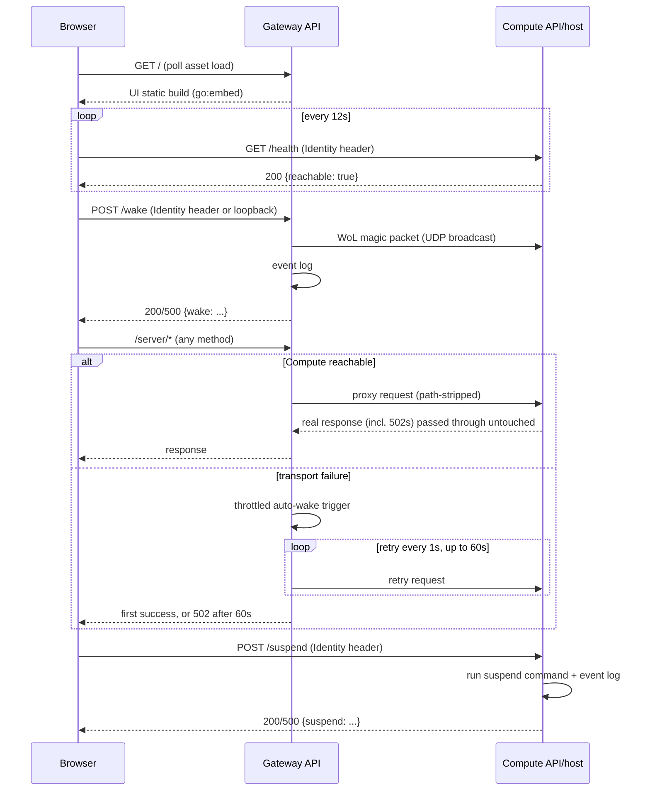

# Architecture

This document is the primary architecture reference for the homelab control plane. It describes the current architecture, key design decisions, and system constraints. For domain vocabulary, see [`CONTEXT.md`](CONTEXT.md). It documents the system as it exists today and does not preserve historical or superseded designs.

## System Overview

**Purpose**: let the user wake, monitor, and suspend their main workload machine ("Compute") from anywhere on their Tailscale tailnet, so it can host Docker services (Immich, AI agents, etc.) without running 24/7 — it sleeps when there's no activity or load, saving electricity and reducing environmental impact (even if the carbon footprint of the workload machine is modest).

**High-level architecture**: two physical devices on the same tailnet and the same LAN broadcast domain.

<p align="center"></p>

**Core responsibilities**:

| Component | Responsibility |
|---|---|
| UI | Browser SPA. Polls Compute reachability, offers Wake/Suspend. Only user-facing surface. |
| Gateway API | One process on the Gateway: serves the UI's static build, sends WoL on `POST /wake`, reverse-proxies `/server/*` to Compute with auto-wake-on-failure. |
| Compute API | Exposes `GET /health` (reachability) and `POST /suspend` on the Compute host. |
| Provisioning (pyinfra) | Declaratively converges both devices to their target state — Tailscale, Docker, and both control-plane binaries. |

## Architecture

### Major components

```
control-plane/
  ui/                    TypeScript + Vite SPA
  cmd/gateway/            Gateway API entrypoint (env → wiring → ListenAndServe)
  cmd/compute-api/        Compute API entrypoint
  internal/gateway/       Gateway API's handlers: static serving, /wake, /server/* proxy
  internal/compute/       Compute API's handlers: CORS, /health, /suspend, suspend command
  internal/tailnet/       shared: identity-header auth middleware, bind-safety assertion
  internal/eventlog/      shared: Grafana Cloud (Loki) event logger
  internal/httpresponse/  shared: JSON response + response-copy helpers
  internal/env/           shared: env-var lookup helpers for cmd/* entrypoints
provisioning/             pyinfra: inventory, settings, one deploy_<x>.py per concern, deploy.py entrypoint
```

### How they interact

- The browser talks to **two origins directly** — the Gateway (UI + Gateway API, same-origin) and the Compute API (separate origin, `tailscale serve`-fronted) — with no server-side relay between them. The Compute API's only extra cost from this is a one-entry CORS allow-list for the UI's origin.
- `/server/*` requests reverse-proxy through the Gateway API to a single, fixed upstream on Compute. Which path reaches which Docker service is entirely that upstream's own concern — invisible to, and outside the scope of, this repo.
- The Gateway API's auto-wake is an **in-process call**, not a network hop: the proxy's error handler and the `/wake` HTTP handler both call the same private `doWake` function directly.
- Provisioning depends on control-plane and ui (it builds and ships their artifacts); nothing in control-plane or ui depends on provisioning.

## Domain Model

Full glossary: [`CONTEXT.md`](CONTEXT.md). Summary of the primary concepts:

| Concept | Meaning |
|---|---|
| **Gateway** | Always-on device (Pi Zero) fronting the system: UI, WoL, workload proxy. |
| **Compute** | The machine that sleeps/wakes and runs the actual workloads. |
| **Reachable** | Whether Compute currently answers the Compute API's health check. |
| **Wake** | Sending a WoL magic packet to bring Compute out of suspend — triggered deliberately (UI button) or automatically (proxy transport failure). |
| **Suspend** | Putting Compute into suspend-to-RAM — the only sleep state this system supports. |
| **Identity header** | `Tailscale-User-Login`, injected by `tailscale serve`; the entire auth mechanism for both apps. |
| **Deploy / Deploy file / Host group** | A pyinfra convergence run / a single-responsibility file scoped to one concern / an inventory grouping (`gateway`, `compute`, `test`). |

### Key entities (code level)

- `gateway.Handler` / `compute.Handler` — one per binary, own the route table and dependencies.
- `reachabilityTracker` (`internal/compute`) — logs `reachability_changed` at most once per process lifetime via `sync.Once`; structurally can't observe going *un*reachable, since the process is asleep whenever that's true.
- `autoWakeThrottler` (`internal/gateway`) — a single `lastRun` timestamp (not one per target — there's exactly one compute upstream) gating repeat automatic wakes to once per 90s.
- `GrafanaCloudLogger` (`internal/eventlog`) — the sole implementation of both apps' `EventLogger` interface.

### Key workflows

1. **Reachability polling** — UI polls `GET /health` on an interval; renders Reachable/Unreachable and enables/disables Wake/Suspend accordingly.
2. **Deliberate wake** — UI's Wake button → Gateway API `POST /wake` → WoL packet + `wake_requested`/`wake_succeeded`/`wake_failed` events.
3. **Automatic wake** — any `/server/*` request while Compute is asleep → Go-level transport failure → throttled wake trigger → request retried every 1s for up to 60s → first successful response written through.
4. **Suspend** — UI's Suspend button → Compute API `POST /suspend` → configured suspend command + `suspend_requested`/`suspend_succeeded`/`suspend_failed` events.
5. **Deploy** — operator runs `./deploy.sh` from the dev machine → pyinfra connects over SSH, builds/ships the Go binaries and UI build, converges systemd units and `tailscale serve` config on both devices.

## Data Flow

### Request paths



### External integrations

| Integration | Purpose | Notes |
|---|---|---|
| **Tailscale** (`tailscale serve`) | TLS termination + identity injection in front of both apps; WoL is a raw UDP broadcast on the LAN, not over Tailscale. | The entire authn/authz boundary is tailnet membership. |
| **Grafana Cloud Loki push API** | Structured event log (wake/suspend/reachability). | Called directly, no local collector/agent. Failures are logged locally and swallowed — never blocks the caller's actual action. |

## Key Design Decisions

Decisions still shaping the current implementation.

- **No server-side relay between the UI's two backend origins** — avoids the Compute API having to trust a forwarded identity claim instead of the real `Tailscale-User-Login` header.
- **Suspend-to-RAM only, no full shutdown** — WoL after ACPI S5 is unreliable across BIOS/NIC configs; the suspend command isn't even configurable via env var, so misconfiguration can't reintroduce shutdown.
- **WoL requires the same L2 broadcast domain** — accepted as a hard requirement rather than building a cross-subnet relay, since both devices share a LAN today.
- **Tailnet membership is the entire authorization boundary** — no separate allow-list; the identity header's mere presence is sufficient.
- **Compute owns all workload routing** — the Gateway's proxy is one blind route to one fixed upstream, so adding/removing workload services never touches this repo.
- **Events ship directly to Grafana Cloud, no local collector** — not worth operating a self-hosted Alloy instance for a handful of low-volume audit events on a single-operator setup.
- **Both control-plane apps are Go, built and shipped as binaries from the dev machine** — no interpreter or dependency tree needed on either device; the two apps can share code directly and Go's fast startup and low memory footprint suit low-resource hardware like the Pi Zero. 
- **The UI is also built off-device** — the Pi Zero is single-core/low-memory; only `dist/` output is ever shipped to it.
- **systemd, not Docker, for both control-plane apps** — the Compute API specifically must stay controllable even while Docker itself is being redeployed.
- **Deploys are manually triggered only** — no CI/cron/hook; an unattended deploy against a two-device personal setup is a risk not worth taking.
- **Secrets are plain dev-machine environment variables** — an encrypted-secrets-file workflow is unneeded complexity for a single-operator setup.

## Extension Points

- **New control-plane action** (e.g. a new endpoint): add a route inside the relevant package's `NewHandler`, define a small interface if it needs an external effect, write a fake for it in tests. Follow the existing `handleWake`/`handleSuspend` shape: log `<action>_requested`, perform the effect, log `_succeeded`/`_failed`, write JSON.
- **New workload service behind `/server/*`**: no change in this repo — routing is entirely Compute's own downstream proxy's responsibility, which is out of this repo's scope.
- **New deployed component**: add `provisioning/deploy_<name>.py`, gate its device-specific logic with `common.has_device_role(...)`, add a settings class to `settings.py` if it needs config, and `local.include(...)` it from `deploy.py`.
- **New event type**: call `logger.SendEvent(eventType, outcome, identity, extra)` — no schema migration, since `event_type`/`outcome`/`app` are Loki stream labels and everything else rides in the log line.

## Constraints

**Assumptions**

- Gateway and Compute remain on the same L2 broadcast domain; there is no cross-subnet WoL path and no error signal if this stops being true.
- Single-operator, two-device scale — not designed for multi-tenant auth, a fleet of compute hosts, or concurrent deploy operators.
- Exactly one compute upstream: the auto-wake throttle and the `/server/*` proxy both assume a single fixed target.

**Performance**

- UI polls `/health` every 12s with a 5s client-side timeout, so a fully powered-off host doesn't leave the UI stuck in "Checking…" indefinitely.
- A cold `/server/*` request during sleep holds the connection for up to 60s (1s retry interval) waiting for Compute to wake.
- Automatic wake is throttled to once per 90s regardless of how many requests arrive in that window.

**Security**

- Auth is entirely tailnet membership via the `Tailscale-User-Login` header injected by `tailscale serve` — no app-level user store, no separate allow-list.
- One deliberate exception: `/wake` also accepts a caller on `127.0.0.1` with no identity header, so the in-process auto-wake trigger doesn't need one — scoped to loopback only.
- `tailnet.AssertTailnetOnlyBind` is a structural backstop at handler construction: both binaries refuse to start if their configured bind address isn't loopback or a Tailscale address, independent of whatever fronts them.
- The Compute API's CORS policy allows exactly one origin (the UI's).

**Known limitations**

- No error path exists if Gateway and Compute are ever split onto different broadcast domains/VLANs — WoL packets simply stop arriving, indistinguishable from no request at all.
- `reachabilityTracker` can only ever observe Compute *becoming* reachable, never becoming unreachable, since the process is asleep whenever that transition happens.
- The Grafana Cloud event pipeline has no retry/buffering: a transient outage drops the event rather than queuing it. Accepted, since these are low-stakes audit events, not anything requiring delivery guarantees.
- Bind-address enforcement is a runtime check inside each binary; pyinfra itself does not verify it at provisioning time.
- The Compute-side downstream workload proxy that `/server/*` forwards to doesn't exist in this repo — it's a manual prerequisite, entirely out of scope.
