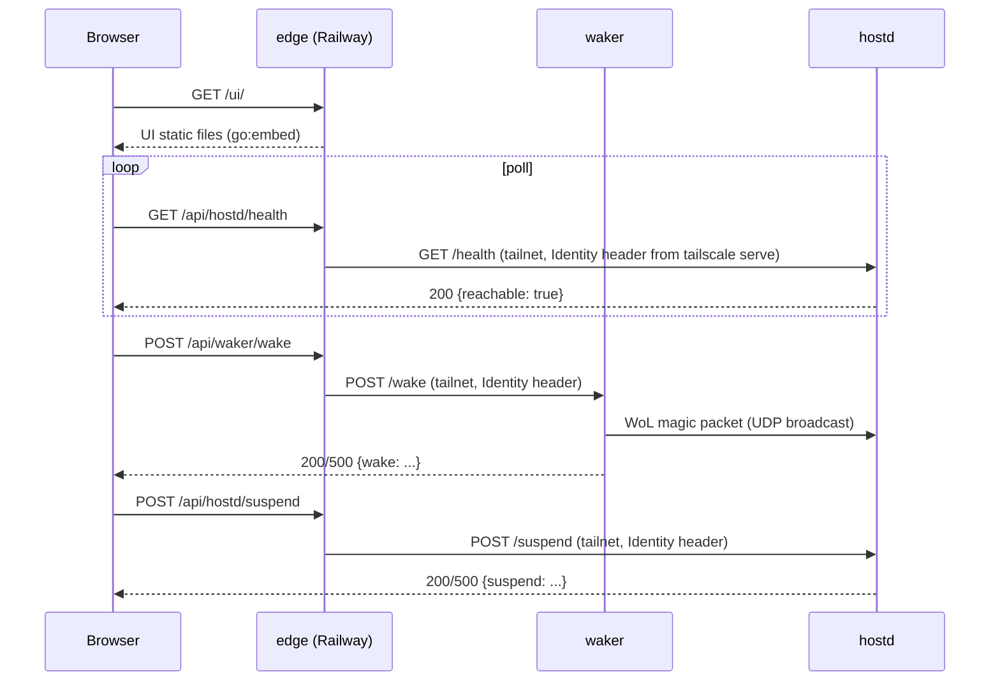

# Design

Why the system is shaped the way it is, and what it can't do. Overview: [README](README.md#how-it-works). Vocabulary: [`CONTEXT.md`](CONTEXT.md). Routes, environment and deployment per surface: [edge](cmd/edge/README.md), [waker](cmd/waker/README.md), [hostd](cmd/hostd/README.md), [ui](ui/README.md), [deploy](DEPLOY.md), [stacks](stacks/README.md).

## Request paths

Workload traffic never touches waker or hostd: off-tailnet it goes edge → `/proxy/<stack>/*` → Caddy (one tailnet hostname per stack) → container. On the tailnet, browsers can hit each Caddy hostname directly.

Every wake, suspend and reachability change is logged as an event to Grafana Cloud. The services are stateless, so that's the only history.

## External integrations

| Integration | Purpose | Gotcha |
|---|---|---|
| **Tailscale** (`tailscale serve`, `tsnet`) | TLS and identity injection in front of waker and hostd; `tsnet` puts edge on the tailnet. WoL is a raw LAN broadcast, not over Tailscale. | edge's node must be user-owned, or `tailscale serve` injects no identity for it. |
| **Railway** | Hosts edge from `deployments/edge/Dockerfile`. | Needs a volume at `/data` for tsnet state. |
| **Grafana Cloud Loki** | Event log. | No local collector, no retry: a transient outage drops the event. |

## Design decisions

- **One public origin, relaying server-side.** The browser talks only to edge, so no backend needs CORS. Backends never trust a forwarded identity: edge drops any incoming `Tailscale-User-Login`, and `tailscale serve` sets it from edge's own node.
- **edge has no authentication, for now.** Deliberate and temporary. Behind edge, tailnet membership is the whole authorization boundary; no allow-list.
- **Workload routing is two layers.** Caddy on blackberry maps hostnames to containers; edge only knows `/proxy/<stack>/` and no stack names, so adding a stack never touches the Go code. Routing skips raspberry (a Pi Zero on Wi-Fi). Cost: no auto-wake on request.
- **Suspend-to-RAM only.** WoL after full shutdown (ACPI S5) is unreliable across BIOS/NIC configs. The suspend command isn't configurable.
- **No workload drain before suspend.** Suspend-to-RAM freezes every process and resumes it in place, so nothing is torn down. In-flight requests stall, though, and can run twice on retry; see [hostd](cmd/hostd/README.md#suspend-never-waits-for-in-flight-work).
- **WoL needs one L2 broadcast domain.** Accepted rather than building a cross-subnet relay.
- **Events go straight to Grafana Cloud.** A self-hosted collector isn't worth it for low-volume audit events.
- **Go binaries under systemd for waker and hostd.** No runtime to install on a Pi Zero, and hostd must stay controllable while Docker itself redeploys. edge is a Docker image because Railway runs images.
- **The UI has no build step and no runtime config.** Static files embedded verbatim in edge; same-origin with every API, so its paths are fixed. No Node toolchain anywhere.
- **Deploys are manual only.** No CI, cron or hooks: unattended deploys aren't worth the risk on two devices.
- **Secrets are plain dev-machine env vars.** One operator; an encrypted-secrets workflow isn't needed.

## Security

- **edge is public and unauthenticated:** anyone with its URL can wake, suspend and reach every stack.
- waker and hostd refuse to start unless bound to loopback or a tailnet address. edge binds publicly by design.
- edge's `/proxy/<stack>/` accepts only a single DNS label as `<stack>`, so public input can't point it at an arbitrary host.
- `/wake` also accepts a loopback caller with no identity (see Identity header in [`CONTEXT.md`](CONTEXT.md)).

## Known limitations

- Wake is manual only: a request to a sleeping blackberry just fails.
- Apps that assume they live at `/` may break under the `/proxy/<stack>/` prefix.
- If raspberry and blackberry end up on different broadcast domains, WoL silently stops working.
- hostd can log blackberry becoming reachable, never unreachable: it's asleep whenever that happens.
- The bind-address check runs at startup only; `task` doesn't verify it.
- Single operator, one blackberry, no concurrent deploys.
