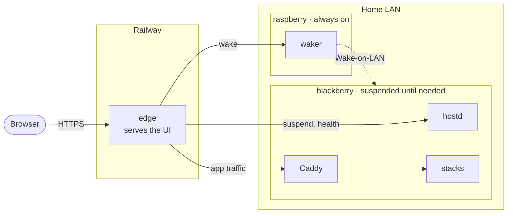

# Cloudberry

The setup that lets me run my home server only when I need it, and reach its
apps from anywhere.

This repo isn't meant for outside contributors. It's written for me and the
AI agents I work with; agent instructions are in [CLAUDE.md](CLAUDE.md).

## How it works

Machines are named for their hardware (both are berries; `cloudberry` is the
whole thing), services for what they do:

| Machine | Hardware | Role |
|---|---|---|
| **blackberry** | Ryzen 3 3250U, 8GB RAM, Ubuntu Server, Ethernet | The home server. Suspended until needed. |
| **raspberry** | Raspberry Pi Zero, Raspbian Lite, Wi-Fi | Always on, low power. On the same LAN as blackberry, so its Wake-on-LAN broadcast lands. |

The repo is a monorepo holding everything in the diagram:

| Part | Code | Runs on | Shipped as |
|---|---|---|---|
| **edge**: public entry point, serves the UI | [cmd/edge](cmd/edge/), [ui/](ui/) (embedded) | Railway | Docker image from [deployments/edge/Dockerfile](deployments/edge/Dockerfile), built by Railway |
| **waker**: sends Wake-on-LAN | [cmd/waker](cmd/waker/) | raspberry | Go binary cross-compiled for armv6, run by systemd |
| **hostd**: suspend, health check | [cmd/hostd](cmd/hostd/) | blackberry | Go binary, run by systemd |
| **stacks**: the apps, behind Caddy | [stacks/](stacks/) | blackberry | Docker Compose, started with `docker compose` (not `task`) |

The three services are one Go module: each has its entrypoint in `cmd/<name>/`
and its logic in `internal/<name>/`, and the rest of `internal/` is shared
code. The stacks don't use it.

edge reaches everything over a Tailscale network. It has no authentication
yet; behind it, access control is tailnet membership.

## Docs

- [CONTEXT.md](CONTEXT.md): domain glossary, the vocabulary everything else uses
- [DESIGN.md](DESIGN.md): design decisions, request paths, security, limitations
- [DEPLOY.md](DEPLOY.md): deploying both machines with `task`
- A README next to each component's code: [edge](cmd/edge/README.md), [waker](cmd/waker/README.md), [hostd](cmd/hostd/README.md), [ui](ui/README.md), [stacks](stacks/README.md)
