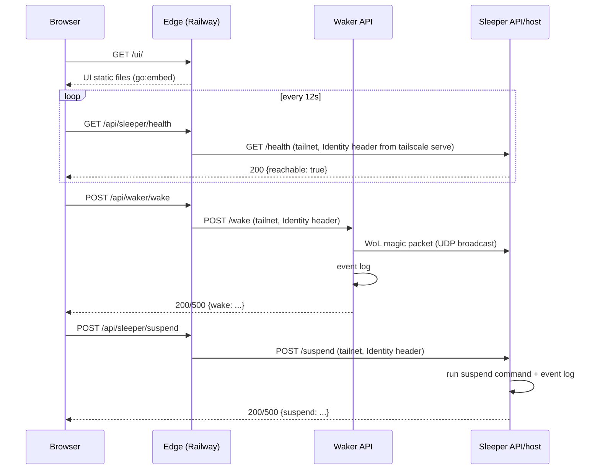

# Architecture

Primary architecture reference for the homelab: current architecture, key decisions, and constraints. Domain vocabulary: [`CONTEXT.md`](../CONTEXT.md). Documents the system as it exists today, not superseded designs.

## System Overview

**Purpose**: wake, monitor, and suspend the main workload machine ("Sleeper") from anywhere, so it can host Docker services (Immich, AI agents, etc.) without running 24/7.

Two physical devices on the same tailnet and LAN broadcast domain, plus Edge on Railway as the one public entry point.

| Component | Responsibility |
|---|---|
| Edge | Public, on Railway. Serves the UI; forwards `/api/*` to the Waker/Sleeper APIs and `/proxy/<stack>/*` to Caddy, over the tailnet via `tsnet`. No auth (for now). |
| UI | Browser SPA. Polls Sleeper reachability, offers Wake/Suspend. Talks only to Edge. |
| Waker API | Sends WoL on `POST /wake`. Carries no workload traffic. |
| Sleeper API | Exposes `GET /health` and `POST /suspend`. |
| Provisioning (pyinfra) | Converges both devices to their target state — Tailscale, Docker, both binaries. |

## Architecture

Folder layout is in this service's [README](README.md#layout). Per-surface
detail — routes, environment, deployment — is in
[`docs/edge.md`](docs/edge.md), [`docs/waker.md`](docs/waker.md), [`docs/sleeper.md`](docs/sleeper.md),
[`docs/ui.md`](docs/ui.md) and [`../docs/deploy.md`](../docs/deploy.md).

### Shared Go packages

Four `internal/` packages the binaries share, none a standalone service:

- **`tailnet`** — `RequireTailnetIdentity` middleware rejects requests missing
  the Identity header with a 401; `GetCallerIdentity` reads it back (presence is
  the entire check, no allow-list). `AssertTailnetOnlyBind(host)`, called at
  handler construction, errors unless `host` is loopback or a Tailscale address.
- **`eventlog`** — `GrafanaCloudLogger.SendEvent(...)` ships structured
  wake/suspend/reachability events to Grafana Cloud's Loki push endpoint. Both
  apps are stateless, so Grafana Cloud is the only place this history lives;
  transport failures are logged and swallowed. `MustGrafanaConfig()` reads the
  `GRAFANA_CLOUD_LOKI_*` trio, shared by the Waker and Sleeper `cmd/*/main.go`.
- **`httpresponse`** — JSON response writing.
- **`env`** — env-var lookup helpers.

### How they interact

- The browser talks to **one origin**, Edge. Edge forwards server-side over the tailnet, so no backend needs CORS.
- Workload traffic never touches Waker or the Sleeper API. Off-tailnet it goes Edge → Caddy (`stacks/caddy`, one tailnet hostname per stack) → container; on the tailnet, browsers can hit each Caddy hostname directly.
- The deploy layer depends on the Go module and `ui/`; neither depends on it.

## Domain Model

See [`CONTEXT.md`](../CONTEXT.md).

### Key entities (code level)

- `edge.NewHandler` / `waker.Handler` / `sleeper.Handler` — one per binary, own the route table and dependencies.
- `reachabilityTracker` (`internal/sleeper`) — logs `reachability_changed` once per process lifetime via `sync.Once`; can't observe going *un*reachable, since the process is asleep whenever that's true.
- `GrafanaCloudLogger` (`internal/eventlog`) — sole implementation of both apps' `EventLogger` interface.

### Key workflows

1. **Reachability polling** — UI polls `GET /api/sleeper/health` (→ `/health`); renders Reachable/Unreachable, toggles Wake/Suspend.
2. **Wake** — Wake button → `POST /api/waker/wake` (→ `/wake`) → WoL packet + `wake_*` events. The only wake path; nothing wakes Sleeper automatically.
3. **Suspend** — Suspend button → `POST /api/sleeper/suspend` (→ `/suspend`) → suspend command + `suspend_*` events.
4. **Deploy** — the repo root's `./deploy.sh` → pyinfra over SSH → builds/ships binaries, converges systemd and `tailscale serve` on both devices. Edge deploys separately, via Railway.

## Data Flow

### Request paths

### External integrations

| Integration | Purpose | Notes |
|---|---|---|
| **Tailscale** (`tailscale serve`, `tsnet`) | TLS termination + identity injection on each device; `tsnet` puts Edge on the tailnet. WoL is a raw UDP broadcast, not over Tailscale. | Edge's node must be user-owned so `tailscale serve` injects an identity for it. |
| **Railway** | Hosts Edge from `Dockerfile`. | Needs a volume at `/data` for tsnet state. |
| **Grafana Cloud Loki push API** | Structured event log (wake/suspend/reachability). | No local collector. Failures are logged and swallowed. |

## Key Design Decisions

- **One public origin, Edge, relaying server-side** — the backends never trust a forwarded identity claim: Edge drops any incoming `Tailscale-User-Login`, and `tailscale serve` sets it from Edge's own tailnet node.
- **Workload routing is two layers** — Caddy on Sleeper maps one tailnet hostname per stack to its container; Edge only exposes Caddy at `/proxy/<stack>/*` and knows no stack names. Routing never goes through the Waker, a Pi Zero W on Wi-Fi. Cost: auto-wake-on-request is gone — Edge doesn't wake Sleeper on a workload request.
- **Suspend-to-RAM only, no full shutdown** — WoL after ACPI S5 is unreliable across BIOS/NIC configs; the suspend command isn't configurable via env var.
- **No graceful workload shutdown before suspend** — suspend-to-RAM freezes every process atomically via the kernel's freezer cgroup and resumes it in place; there's no in-flight work to lose, so nothing to drain.
- **WoL requires the same L2 broadcast domain** — accepted rather than building a cross-subnet relay.
- **Edge has no authentication (for now)** — deliberate and temporary; auth will be added later. Behind Edge, tailnet membership is the authorization boundary, no separate allow-list.
- **Events ship directly to Grafana Cloud, no local collector** — not worth a self-hosted Alloy instance for low-volume audit events.
- **Both apps are Go, built and shipped as binaries** — no interpreter/dependency tree on-device; suits low-resource hardware like the Pi Zero.
- **The UI has no build step and no runtime config** — static HTML/JS/CSS, `//go:embed`ded verbatim into the Edge binary. Same-origin with every API it calls, so its base paths are fixed. No Node toolchain anywhere, and no staging copy between `ui/` and the binary.
- **systemd, not Docker, for the Waker and Sleeper APIs** — the Sleeper API must stay controllable while Docker itself redeploys. Edge is a Docker image because Railway runs images.
- **Deploys are manually triggered only** — no CI/cron/hook, to avoid unattended-deploy risk on a two-device setup.
- **Secrets are plain dev-machine environment variables** — an encrypted-secrets workflow is unneeded for a single-operator setup.

## Extension Points

- **New control-plane action**: add a route in the relevant `NewHandler`, define a small interface for external effects, fake it in tests. Follow `handleWake`/`handleSuspend`'s shape: log `_requested`, perform the effect, log `_succeeded`/`_failed`, write JSON.
- **New workload service**: add a stack plus its Caddy site block (see `docs/agents/stacks.md`) — no Edge, Waker or Sleeper API change. Reachable at `/proxy/<stack>/` on Edge.
- **New deployed component**: add `deploy/deploy_<name>.py`, gate with `common.has_device_role(...)`, add settings if needed, `local.include(...)` it from `deploy.py`.
- **New event type**: call `logger.SendEvent(eventType, outcome, identity, extra)` — no schema migration; labels are fixed, everything else rides in the log line.

## Constraints

**Assumptions**
- Waker and Sleeper stay on the same L2 broadcast domain; no cross-subnet WoL path or error signal if that stops being true.
- Single-operator, two-device scale — not multi-tenant, no fleet of Sleepers, no concurrent deploys.
- Exactly one Sleeper, reached at one fixed origin.

**Performance**
- UI polls `/health` every 12s with a 5s client timeout, so a powered-off host doesn't strand the UI in "Checking…".

**Security**
- **Edge is unauthenticated**: anyone with its URL can wake, suspend and reach every workload. Temporary, until auth is added.
- Behind Edge, auth is tailnet membership via `Tailscale-User-Login` — no app-level user store or allow-list.
- One exception, loopback-scoped: `/wake`. It was there for the Waker's own in-process auto-wake trigger; with that trigger gone it now only covers a shell on the Pi itself.
- `tailnet.AssertTailnetOnlyBind` is a structural backstop: the Waker and Sleeper APIs refuse to start if their bind address isn't loopback or tailnet. Edge binds publicly by design.
- Edge's `/proxy/<stack>/` only accepts a single DNS label as `<stack>`, so public input can't point it at an arbitrary host.

**Known limitations**
- Wake is manual only. A workload request to a sleeping Sleeper just fails. Press Wake first.
- Apps that assume they live at `/` may break under Edge's `/proxy/<stack>/` prefix.
- `docs/architecture.png` predates Edge.
- No error path if Waker and Sleeper split onto different broadcast domains/VLANs — WoL packets just stop arriving.
- `reachabilityTracker` can only observe Sleeper *becoming* reachable, never unreachable, since the process is asleep whenever that transition happens.
- The Grafana Cloud pipeline has no retry/buffering — a transient outage drops the event. Accepted for low-stakes audit events.
- Bind-address enforcement is a runtime check per binary; pyinfra doesn't verify it at provisioning time.
- No workload Compose stack (Immich, etc.) has been deployed yet — Docker is provisioned on Sleeper, but nothing runs on it.
